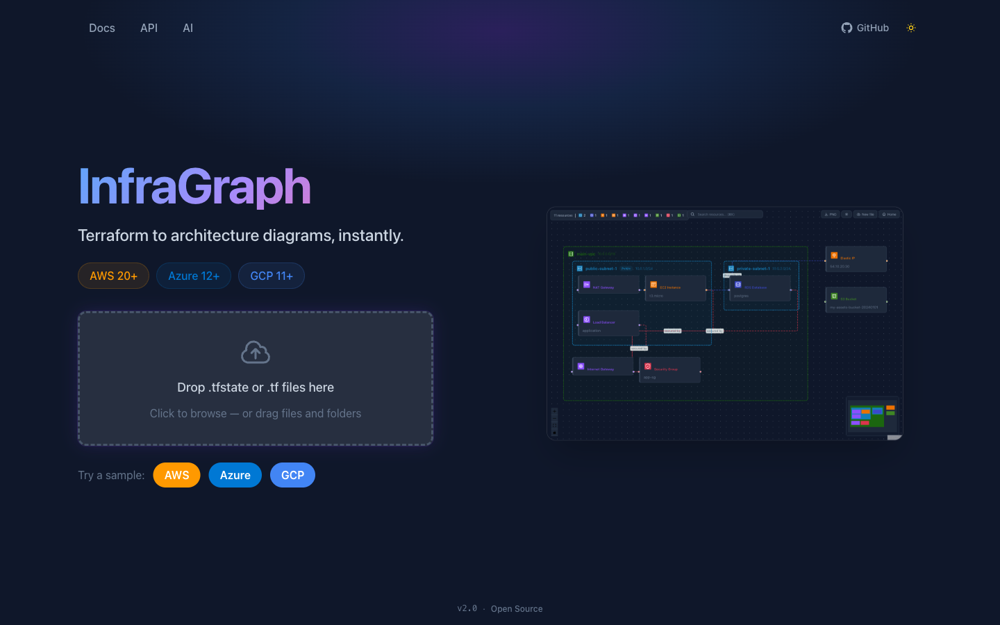
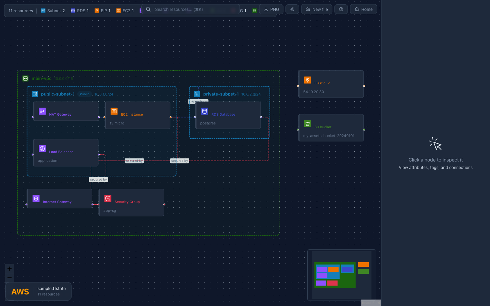
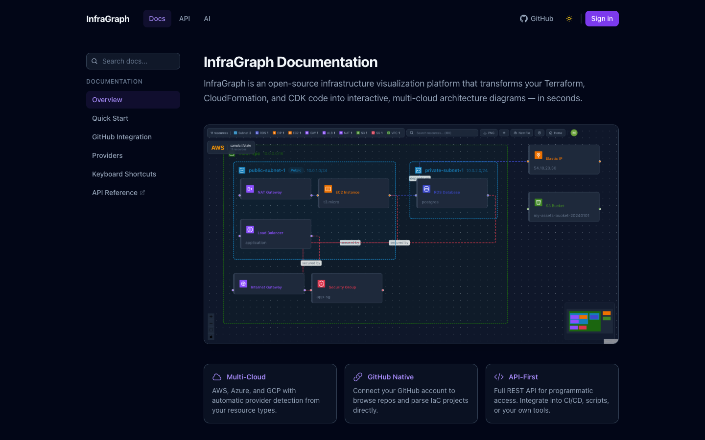

# InfraGraph

Visualize your Terraform infrastructure as interactive architecture diagrams. Upload files, connect a GitHub repo, or call the REST API — InfraGraph auto-detects your cloud provider and renders a live, zoomable canvas with VPCs, subnets, and resources.







## Features

- **Multi-cloud** — AWS (20+), Azure (12+), and GCP (11+) resource types with branded icons
- **GitHub Integration** — Connect your GitHub account, browse repos (including private), scan for Terraform projects, and visualize directly
- **REST API** — Full programmatic access for CI/CD pipelines, scripts, and custom integrations
- **Session History** — Save and revisit past diagrams (requires Supabase auth)
- Parse Terraform state files (`.tfstate`) and HCL source files (`.tf`)
- Auto-layout: VPC > Subnet > Resource hierarchy with nested containers
- Interactive React Flow canvas with zoom, pan, minimap, and dark mode
- Click any node to inspect attributes, tags, and connections
- Provider badge showing cloud provider, filename, and resource count
- Export diagrams as PNG
- Search resources with `Cmd+K`
- Resource type filter badges with counts
- Built-in documentation with searchable guides and dedicated API reference
- Client-side routing with browser back/forward support
- Sample infrastructure for quick demo (one click per provider)
- Auto-detection of cloud provider from resource types
- Google OAuth sign-in with Supabase (optional — works in guest mode without it)
- Fully Dockerized with multi-stage builds

## Project Structure

```
infragraph/
├── apps/
│   ├── backend/           # Express API — parses tfstate/HCL, GitHub integration
│   │   ├── src/
│   │   │   ├── parser/    # tfstate, graph, and HCL parsers
│   │   │   ├── providers/ # Cloud provider configs (aws, azure, gcp)
│   │   │   ├── services/  # GitHub service (OAuth, repos, scan, fetch)
│   │   │   ├── routes/    # API route handlers (parse, github, sessions, user)
│   │   │   └── middleware/ # Auth middleware (optionalAuth, requireAuth)
│   │   └── Dockerfile
│   └── frontend/          # Vite + React 18 — React Flow canvas + UI
│       ├── src/
│       │   ├── components/  # Canvas, nodes, panels, modals, docs
│       │   ├── providers/   # Frontend provider configs (aws, azure, gcp)
│       │   └── lib/         # API client, auth, GitHub utilities
│       └── Dockerfile
├── packages/
│   └── shared/            # Shared TypeScript types
├── e2e/                   # Playwright end-to-end tests
├── test/
│   ├── fixtures/
│   │   ├── projects/      # 11 .tf source test projects
│   │   └── tfstate/       # 11 .tfstate test fixtures
│   └── screenshots/
├── docker-compose.yml
└── Makefile
```

## Quick Start

```bash
# With Docker (recommended)
make up

# Without Docker
make install dev
```

Open http://localhost:3000, select a cloud provider, and upload a `.tfstate` or `.tf` file — or click **Connect GitHub Repo** to browse your repositories.

## Prerequisites

- **Docker** (recommended) — no other dependencies needed
- **Without Docker**: Node.js 20+, npm 10+

## Environment Variables

### Backend (`apps/backend/.env`)

| Variable | Required | Description |
|----------|----------|-------------|
| `PORT` | No | Server port (default: 3001) |
| `FRONTEND_URL` | No | Frontend URL for CORS (default: http://localhost:3000) |
| `SUPABASE_URL` | No | Supabase project URL (enables auth & sessions) |
| `SUPABASE_SERVICE_ROLE_KEY` | No | Supabase service role key |
| `GITHUB_CLIENT_ID` | No | GitHub OAuth App client ID (enables GitHub connect) |
| `GITHUB_CLIENT_SECRET` | No | GitHub OAuth App client secret |

### Frontend (`apps/frontend/.env`)

| Variable | Required | Description |
|----------|----------|-------------|
| `VITE_SUPABASE_URL` | No | Supabase project URL |
| `VITE_SUPABASE_ANON_KEY` | No | Supabase anon key |
| `VITE_GITHUB_CLIENT_ID` | No | GitHub OAuth App client ID |
| `VITE_API_URL` | No | Backend API URL override |

All features degrade gracefully — the app works in guest mode without any env vars.

### GitHub OAuth Setup

To enable the "Connect to GitHub" feature:

1. Create a GitHub OAuth App at https://github.com/settings/developers
2. Set the callback URL to `http://localhost:3000/auth/github-callback`
3. Add `GITHUB_CLIENT_ID` and `GITHUB_CLIENT_SECRET` to backend `.env`
4. Add `VITE_GITHUB_CLIENT_ID` to frontend `.env`

## Development

```bash
make install       # Install all dependencies
make dev           # Run backend (3001) + frontend (3000) concurrently
make dev-backend   # Run backend only
make dev-frontend  # Run frontend only
```

## Docker

```bash
make up            # Build and start all services
make down          # Stop and remove containers
make restart       # Full restart (down + clean + build + up)
make logs          # Tail container logs
make ps            # Show container status
```

## Testing

```bash
make test          # Run all tests (unit + smoke)
make test-unit     # Vitest unit tests with coverage
make test-e2e      # Playwright end-to-end tests
make lint          # ESLint across all workspaces
make typecheck     # TypeScript type checking
make check         # Run lint + typecheck + test (CI equivalent)
```

## API

Interactive Swagger docs available at http://localhost:3001/docs when the backend is running.

### Parse Endpoints

| Method | Endpoint | Description |
|--------|----------|-------------|
| `POST` | `/api/parse` | Upload a `.tfstate` file (multipart form, field: `tfstate`) |
| `POST` | `/api/parse/raw` | Send raw tfstate JSON: `{ "tfstate": "..." }` |
| `POST` | `/api/parse/hcl` | Upload `.tf` files (multipart form, field: `files`) |

### GitHub Endpoints

| Method | Endpoint | Description |
|--------|----------|-------------|
| `POST` | `/api/github/token` | Exchange OAuth code for access token |
| `GET` | `/api/github/repos` | List authenticated user's repos (requires `X-GitHub-Token` header) |
| `POST` | `/api/github/scan` | Scan a repo for Terraform projects |
| `POST` | `/api/github/parse` | Parse a Terraform project from a GitHub repo |

### System

| Method | Endpoint | Description |
|--------|----------|-------------|
| `GET` | `/health` | Health check |

All parse endpoints return:

```ts
{
  nodes: GraphNode[];
  edges: GraphEdge[];
  resources: CloudResource[];
  provider: CloudProvider;
  warnings: string[];
}
```

GitHub endpoints accept an optional `X-GitHub-Token` header for private repo access and higher rate limits (5,000 req/hr vs 60 req/hr).

## Supported Cloud Providers

| Provider | Status | Resource Types |
|----------|--------|----------------|
| **AWS** | Supported | VPC, Subnet, EC2, RDS, S3, Lambda, ECS, EKS, ALB, and 20+ more |
| **Azure** | Supported | VNet, Subnet, VM, Storage, SQL, Functions, NSG, Public IP, LB, AKS, and more |
| **GCP** | Supported | VPC, Subnet, Compute, Cloud SQL, GCS, Functions, Firewall, LB, GKE, and more |

## Test Fixtures

The project includes 22 test fixtures covering diverse AWS architectures:

**`.tf` source projects** (`test/fixtures/projects/`):

| # | Project | Description |
|---|---------|-------------|
| 01 | static-site | CloudFront + S3 + Route53 + WAF |
| 02 | microservices | EKS cluster + RDS + Redis + ECR |
| 03 | data-lake | Glue + Kinesis + S3 zones + Athena |
| 04 | cicd-pipeline | CodePipeline + CodeBuild + ECR |
| 05 | monitoring | CloudWatch alarms + SNS + Firehose |
| 06 | multi-region | Active-active with Route53 failover |
| 07 | container-platform | ECS Fargate + ALB + Service Discovery |
| 08 | serverless-api | API Gateway + Lambda + DynamoDB + SQS |
| 09 | ml-pipeline | SageMaker + Step Functions + Lambda |
| 10 | network-hub | Transit Gateway + VPN + 3 VPCs |
| 11 | full-stack | Compute + Networking + Serverless combined |

**`.tfstate` files** (`test/fixtures/tfstate/`) — ordered simple to complex (6 → 16 resources).

## License

Apache-2.0 with Commons Clause
